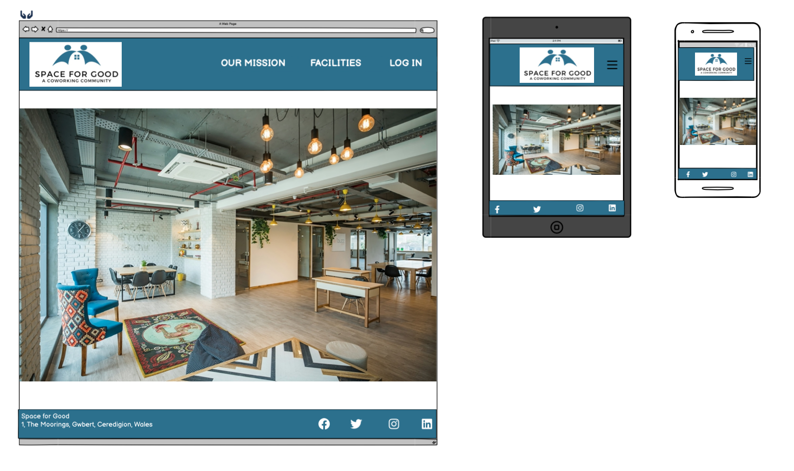
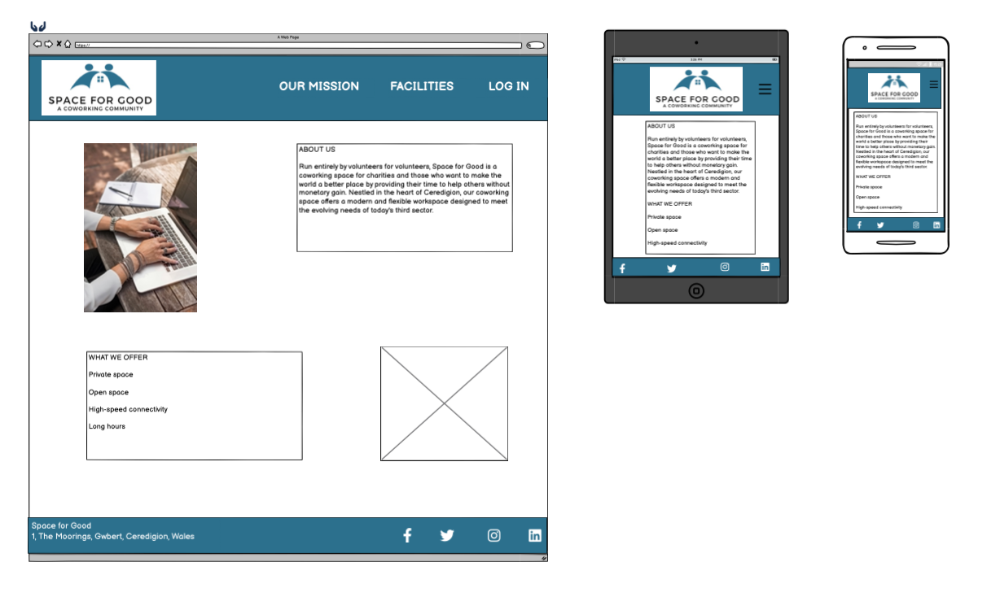
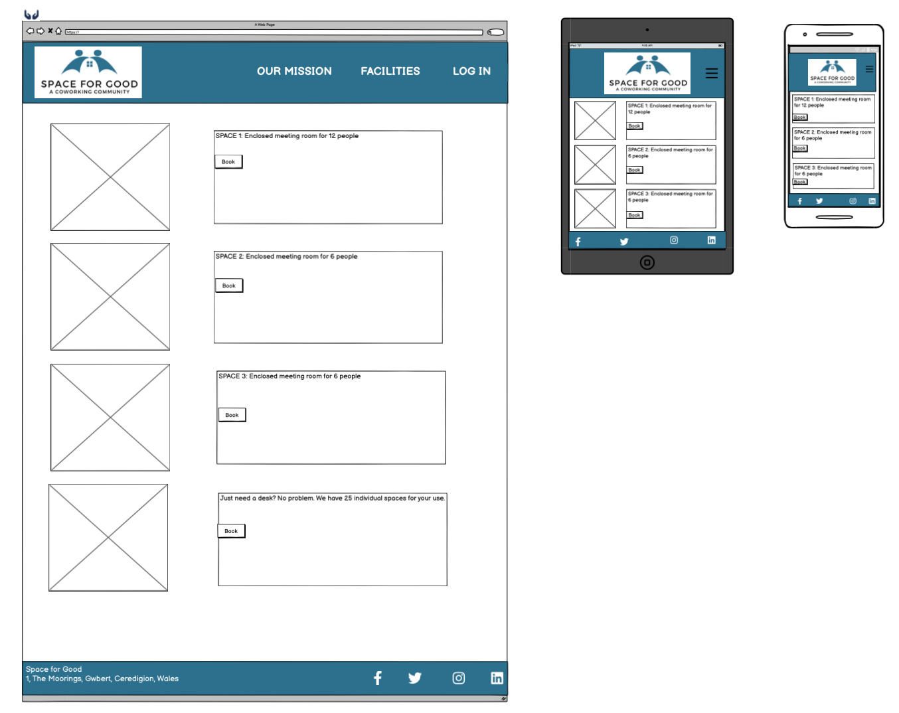
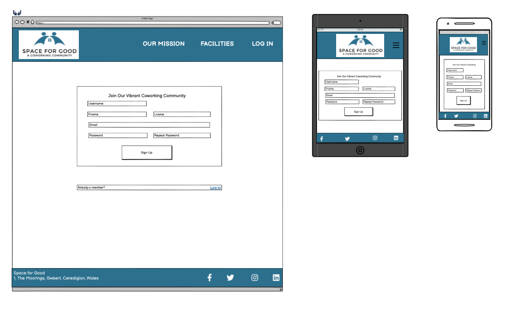

<h1>Space for Good Coworking Community</h1>

<strong>Table of Contents</strong>
<ol>
<li>Introduction</li>
<li>Features</li>
<li>Wireframes</li>
<li>Responsiveness</li>
<li>Browser Compatibility</li>
<li>Code Validation</li>
<li>Deployment</li>
<li>User Story Tests</li>
<li>Bugs Solved</li>
<li>Bugs Unresolved</li>
<li>Future Sprints</li>
<li>Credits/Sources</li>
</ol>

<h2>Introduction</h2>

Run entirely by volunteers for volunteers, Space for Good is a coworking space for charities and those who want to make the world a better place by providing their time to help others without monetary gain.  Space for Good offers a variety of coworking environments that can be booked by registered users. 

<h2>Features</h2>

<h3>Header & Footer</h3>

The header features the Space for Good logo.  On larger screens, the header also provides the nav bar options.  Smaller screens have a drop-down menu.  The footer provides social media links and, on larger screens, the contact details.
<h3>Register</h3>
<h3>Log in</h3>
<h3>Log out</h3>
<h3>Booking a facility</h3>

<h2>Wireframes</h2>
Landing page:

Our Mission:

Facilities:

Account:

<h2>Responsiveness</h2>

<h2>Browser Compatibility</h2>

<h2>Code Validation</h2>

<h2>Deployment</h2>

<h2>User Story Tests</h2>
<table>
    <tr>
        <th></th>
        <th>User Story</th>
        <th>MoSCoW</th>
        <th>Status</th>
    </tr>
    <tr>
        <td>1</td>
        <td> </td>
        <td> </td>
        <td> </td>
    </tr>
        <tr>
        <td>2</td>
        <td> </td>
        <td> </td>
        <td> </td>
    </tr>
        <tr>
        <td>3</td>
        <td> </td>
        <td> </td>
        <td> </td>
    </tr>
</table>

<h2>Bugs Solved</h2>

<h2>Bugs Unresolved</h2>

<h2>Future Sprints</h2>

<h2>Credits/Sources</h2>

Hero image on landing page from Photo by <a href="https://unsplash.com/@myhq?utm_content=creditCopyText&utm_medium=referral&utm_source=unsplash">myHQ Workspaces</a> on <a href="https://unsplash.com/photos/brown-wooden-table-with-chairs-VCoh27vHEh0?utm_content=creditCopyText&utm_medium=referral&utm_source=unsplash">Unsplash</a>

Image on Our Mission page from Photo by <a href="https://unsplash.com/@linkedinsalesnavigator?utm_content=creditCopyText&utm_medium=referral&utm_source=unsplash">LinkedIn Sales Solutions</a> on <a href="https://unsplash.com/photos/person-typing-on-macbook-pro-on-brown-wooden-table-during-daytime-photo-0QvTyp0gH3A?utm_content=creditCopyText&utm_medium=referral&utm_source=unsplash">Unsplash</a>
  

Logo designed with <a href="https://www.canva.com/">Canva</a>

Favicon from <a href="https://fontawesome.com/">FontAwesome</a>
  