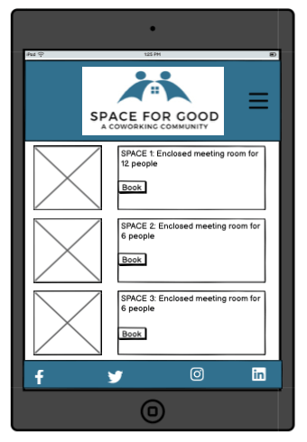
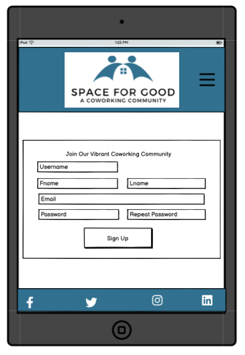

# [SPACE FOR GOOD](https://spaceforgood-264af18d8428.herokuapp.com)

[](https://github.com/KJWhitehead/space-for-good/commits/main)
[](https://github.com/KJWhitehead/space-for-good/commits/main)
[](https://github.com/KJWhitehead/space-for-good)

Run entirely by volunteers for volunteers, Space for Good is a coworking space for charities and those who want to make the world a better place by providing their time to help others without monetary gain. Space for Good offers a variety of coworking environments that can be booked by registered users.

🛑🛑
Consider adding a mockup image using the "Am I Responsive" website.
Here's your deployed site as an example:
https://ui.dev/amiresponsive?url=https://spaceforgood-264af18d8428.herokuapp.com
🛑🛑 I would but it looks bad in the phone view. 

## UX

In designing this project, I wanted to create a website with full CRUD functionality that also served a useful purpose.  While this place is entirely fictional, I believe Space for Good would fulfill a valuable niche in the broader community if it existed, providing volunteers and charities the opportunity to use a coworking space for free amongst like-minded individuals.  

### Landing Page

I decided on a landing page with a photo of a space with a relaxed, earthy vibe in contrast to a high-stress, competitive, Silicon Valley tone to emphasize the volunteer and community focus. The navigation bar allows the user to go between the different pages easily and infoms the user which page they are on.

### Our Mission Page

As this is a more niche coworking space, a description of the community has been given here.

### Facilities Pages

Because these individuals and groups may need space for individuals or teams, a variety of spaces are available for booking in two-hour segments during the day.

### Colour Scheme

A calming series of blues was chosen for the header, footer, and buttons, while an off-white was chosen for the background.

- `#31708E` for header, footer, and buttons.
- `#8fc1e3` used for hover functions.
- `#F7F9FB` for the background and social media icons.

- `#000000` used for text.
- `#8B0000` used for highlights.

I used [coolors.co](https://coolors.co/31708e-8fc1e3-f7f9fb) to generate my colour palette.


### Typography

- [Montserrat](https://fonts.google.com/specimen/Montserrat) was used for the primary headers and titles.

- [Roboto](https://fonts.google.com/specimen/Roboto) was used for all other secondary text.

- [Font Awesome](https://fontawesome.com) icons were used throughout the site, such as the social media icons in the footer.

## User Stories

### New Site Users

- As a new site user, I would like to view the NavBar on every page, so that I can quickly navigate the site.
- As a new site user, I would like to register an account, so that I can make bookings.
- As a new site user, I would like to to know when I can use the workspaces, so that I can volunteer in the evenings and weekends.
- As a new site user, I would like to see what is available in coworking space, so that I can make an informed decision before signing up.
- As a new site user, I would like to to know the rules of the space (like if guests are permitted), so that I can decide whether to register.

### Returning Site Users

- As a returning site user, I would like to know the location and nearby amenities of the coworking space, so that I can know where to go and what I can eat there.
- As a returning site user, I would like to easily book a workspace for a specific date and time through an intuitive online platform, so that I can plan my work schedule efficiently.
- As a returning site user, I would like contact information, so that I can reach out to the coworking space with specific demands.
- As a returning site user, I would like to see a calendar of upcoming networking events, workshops, and professional development opportunities hosted by the coworking space, so that I can stay engaged and connected with other charities.
- As a returning site user, I would like to see a member directory, so that I can connect with others.

### Site Admin

- As a site administrator, I should be able to use recognizable branding, so that our brand is clear to users.
- As a site administrator, I want users to be able to log in and out with notifications, so that they are aware of their status.
- As a site administrator, I should be able to advertise how to volunteer as workers at Space for Good, so that I can maintain the free community space.

## Wireframes

🛑🛑🛑🛑🛑🛑🛑🛑🛑🛑 This is so ugly but I don't know how to clean it up.

To follow best practice, wireframes were developed for mobile, tablet, and desktop sizes.
I've used [Balsamiq](https://balsamiq.com/wireframes) to design my site wireframes.

### Mobile Wireframes

<details>
<summary> Click here to see the Mobile Wireframes </summary>

Home
  - 

Our Mission
  - 

Facilities
  - 

Sign Up
  - 

</details>

### Tablet Wireframes

<details>
<summary> Click here to see the Tablet Wireframes </summary>

Home
  - 

Our Mission
  - 

Facilities
  - 

Sign Up
  - 

</details>

### Desktop Wireframes

<details>
<summary> Click here to see the Desktop Wireframes </summary>

Home
  - 

Our Mission
  - 

Facilities
  - 

Sign Up
  - 

</details>

## Features

### Existing Features

- **{{ HEADER AND NAVIGATION }}**

    - Site branding on left for brand recognition
    - Nav bar provides links to pages and indicates current page for ease of use
    - Visible on all pages


- **{{ FOOTER }}**

    - Address and phone number of Space for Good for contacting
    - Social media links for additional information about the space
    - Visible on all pages


- **{{ HOME SCREEN }}**

    - Provides a visual representation of the spaces offered for the potential client


- **{{ OUR MISSION PAGE }}**
    - Provides a brief description of the mission of Space for Good
    - Provides a brief description of the spaces available
    - Provides a map with the location of the organization


- **{{ CREATE AN ACCOUNT }}**

    - Users must create an account to view Facilities
    - This offers a secure way to manage bookings at Space for Good


- **{{ LOG IN }}**

    - Users may sign in to their individual account
    - Confirmation of success is displayed at top


- **{{ FACILITIES PAGE }}**

    - Once logged in, detailed information about the facilities is available
    - Users may also view their existing bookings from a link here


- **{{ CREATE A BOOKING }}**

    - Drop-downs of spaces, dates, and times allows the user ease of choices


- **{{ SEE MY CURRENT BOOKINGS }}**

    - Users may view their existing bookings


- **{{ EDIT A BOOKING }}**

    - Users may edit their existing bookings if needed


- **{{ DELETE A BOOKING }}**

    - Users may delete their existing bookings if needed


### Future Features

- {{ CALENDAR OF EVENTS }}
    - A calendar to clearly show the scheduled events that the space will hold.
- {{ VOLUNTEER FORM }}
    - A form prospective volunteers can complete with availability and interests.
- {{ SPECIAL INTEREST GROUP REGISTRATION }}
    - The user registration will include special interest groups for better networking.

## Tools & Technologies Used

- [](https://git-scm.com) used for version control. (`git add`, `git commit`, `git push`)
- [](https://github.com) used for secure online code storage.
- [](https://gitpod.io) used as a 
- [](https://en.wikipedia.org/wiki/HTML) used for the main site content.
- [](https://en.wikipedia.org/wiki/CSS) used for the main site design and layout.
- [](https://www.javascript.com) used for user interaction on the site.
- [](https://www.python.org) used as the back-end programming language.
- [](https://www.heroku.com) used for hosting the deployed back-end site.
- [](https://getbootstrap.com) used as the front-end CSS framework for modern responsiveness and pre-built components.
- [](https://www.djangoproject.com) used as the Python framework for the site.
- [](https://www.postgresql.org) used as the relational database management.
- [](https://dbs.ci-dbs.net) used as the Postgres database from Code Institute.
- [](https://www.elephantsql.com) used as the Postgres database.
- [](https://whitenoise.readthedocs.io) used for serving static files with Heroku.
- [](https://balsamiq.com/wireframes) used for creating wireframes.
- [](https://www.canva.com/p/canvawireframes) used for creating wireframes.
- [](https://fontawesome.com) used for the icons.
🛑🛑🛑🛑Crispy Forms?
🛑🛑🛑🛑SummerNote?
🛑🛑🛑🛑That database builder?


## Database Design

Entity Relationship Diagrams (ERD) help to visualize database architecture before creating models.
Understanding the relationships between different tables can save time later in the project.

```python
class Facilities(models.Model):
    title = models.CharField(max_length=200)
    content = models.TextField()

    def __str__(self):
        return self.title


class Space(models.Model):

    TYPES = (
        ("Meeting Room", "Meeting Room"),
        ("Open Seating", "Open Seating"),
    )

    name = models.CharField(max_length=50, null=False, blank=False)
    max_capacity = models.PositiveIntegerField(
        default=1,
        validators=[MinValueValidator(1), MaxValueValidator(12)],
        null=False, blank=False
    )
    space_type = models.CharField(
        choices=TYPES, max_length=20, null=False, blank=False
    )

    def __str__(self):
        return self.name


class Reservation(models.Model):

    TIMES = (
        ("09:00-11:00", "09:00-11:00"),
        ("11:00-13:00", "11:00-13:00"),
        ("13:00-15:00", "13:00-15:00"),
        ("15:00-17:00", "15:00-17:00"),
        ("17:00-19:00", "17:00-19:00"),
    )

    user = models.ForeignKey(
        User, on_delete=models.CASCADE,
        related_name="main.Reservation.user+"
    )
    space = models.ForeignKey(
        Space, on_delete=models.CASCADE,
        related_name="main.Reservation.space+"
    )
    date = models.DateField(null=False, blank=False)
    time = models.CharField(
        choices=TIMES, max_length=20, null=False, blank=False
    )

    def user_can_delete(self, user):
        return user == self.user

    def __str__(self):
        return self.user.username
```

I have used `pygraphviz` and `django-extensions` to auto-generate an ERD.

The steps taken were as follows:
- In the terminal: `sudo apt update`
- then: `sudo apt-get install python3-dev graphviz libgraphviz-dev pkg-config`
- then type `Y` to proceed
- then: `pip3 install django-extensions pygraphviz`
- in my `settings.py` file, I added the following to my `INSTALLED_APPS`:
```python
INSTALLED_APPS = [
    ...
    'django_extensions',
    ...
]
```
- back in the terminal: `python3 manage.py graph_models -a -o erd.png`
- dragged the new `erd.png` file into my `documentation/` folder
- removed `'django_extensions',` from my `INSTALLED_APPS`
- finally, in the terminal: `pip3 uninstall django-extensions pygraphviz -y`


source: [medium.com](https://medium.com/@yathomasi1/1-using-django-extensions-to-visualize-the-database-diagram-in-django-application-c5fa7e710e16)


## Agile Development Process

### GitHub Projects

[GitHub Projects](https://github.com/KJWhitehead/space-for-good/projects) served as an Agile tool for this project.
It isn't a specialized tool, but with the right tags and project creation/issue assignments, it can be made to work.

Through it, user stories, issues, and milestone tasks were planned, then tracked on a weekly basis using the basic Kanban board.

### GitHub Issues

[GitHub Issues](https://github.com/KJWhitehead/space-for-good/issues) served as an another Agile tool.
There, I used my own **User Story Template** to manage user stories.

It also helped with milestone iterations on a weekly basis.

- [Open Issues](https://github.com/KJWhitehead/space-for-good/issues) [](https://github.com/KJWhitehead/space-for-good/issues)

- [Closed Issues](https://github.com/KJWhitehead/space-for-good/issues?q=is%3Aissue+is%3Aclosed) [](https://github.com/KJWhitehead/space-for-good/issues?q=is%3Aissue+is%3Aclosed)

### MoSCoW Prioritization

I've decomposed my Epics into stories prior to prioritizing and implementing them.
Using this approach, I was able to apply the MoSCow prioritization and labels to my user stories within the Issues tab.

- **Must Have**: guaranteed to be delivered (*max 60% of stories*)
- **Should Have**: adds significant value, but not vital (*the rest ~20% of stories*)
- **Could Have**: has small impact if left out (*20% of stories*)
- **Won't Have**: not a priority for this iteration

## Testing

> [!NOTE]  
> For all testing, please refer to the [TESTING.md](TESTING.md) file.

## Deployment

The live deployed application can be found deployed on [Heroku](https://spaceforgood-264af18d8428.herokuapp.com).

### PostgreSQL Database

This project uses a [Code Institute PostgreSQL Database](https://dbs.ci-dbs.net).

To obtain my own Postgres Database from Code Institute, I followed these steps:

- Signed-in to the CI LMS using my email address.
- An email was sent to me with my new Postgres Database.

> [!CAUTION]  
> - PostgreSQL databases by Code Institute are only available to CI Students.
> - You must acquire your own PostgreSQL database through some other method
> if you plan to clone/fork this repository.
> - Code Institute students are allowed a maximum of 8 databases.
> - Databases are subject to deletion after 18 months.

### Heroku Deployment

This project uses [Heroku](https://www.heroku.com), a platform as a service (PaaS) that enables developers to build, run, and operate applications entirely in the cloud.

Deployment steps are as follows, after account setup:

- Select **New** in the top-right corner of your Heroku Dashboard, and select **Create new app** from the dropdown menu.
- Your app name must be unique, and then choose a region closest to you (EU or USA), and finally, select **Create App**.
- From the new app **Settings**, click **Reveal Config Vars**, and set your environment variables.

> [!IMPORTANT]  
> This is a sample only; you would replace the values with your own if cloning/forking my repository.

| Key | Value |
| --- | --- |
| `DATABASE_URL` | user's own value |
| `DISABLE_COLLECTSTATIC` | 1 (*this is temporary, and can be removed for the final deployment*) |
| `SECRET_KEY` | user's own value |

Heroku needs three additional files in order to deploy properly.

- requirements.txt
- Procfile
- runtime.txt

You can install this project's **requirements** (where applicable) using:

- `pip3 install -r requirements.txt`

If you have your own packages that have been installed, then the requirements file needs updated using:

- `pip3 freeze --local > requirements.txt`

The **Procfile** can be created with the following command:

- `echo web: gunicorn app_name.wsgi > Procfile`
- *replace **app_name** with the name of your primary Django app name; the folder where settings.py is located*

The **runtime.txt** file needs to know which Python version you're using:
1. type: `python3 --version` in the terminal.
2. in the **runtime.txt** file, add your Python version:
	- `python-3.9.18`

For Heroku deployment, follow these steps to connect your own GitHub repository to the newly created app:

Either:

- Select **Automatic Deployment** from the Heroku app.

Or:

- In the Terminal/CLI, connect to Heroku using this command: `heroku login -i`
- Set the remote for Heroku: `heroku git:remote -a app_name` (replace *app_name* with your app name)
- After performing the standard Git `add`, `commit`, and `push` to GitHub, you can now type:
	- `git push heroku main`

The project should now be connected and deployed to Heroku!

### Local Deployment

This project can be cloned or forked in order to make a local copy on your own system.

For either method, you will need to install any applicable packages found within the *requirements.txt* file.

- `pip3 install -r requirements.txt`.

You will need to create a new file called `env.py` at the root-level,
and include the same environment variables listed above from the Heroku deployment steps.

> [!IMPORTANT]  
> This is a sample only; you would replace the values with your own if cloning/forking my repository.

Sample `env.py` file:

```python
import os

os.environ.setdefault("DATABASE_URL", "user's own value")
os.environ.setdefault("SECRET_KEY", "user's own value")

# local environment only (do not include these in production/deployment!)
os.environ.setdefault("DEBUG", "True")
```

Once the project is cloned or forked, in order to run it locally, you'll need to follow these steps:

- Start the Django app: `python3 manage.py runserver`
- Stop the app once it's loaded: `CTRL+C` or `⌘+C` (Mac)
- Make any necessary migrations: `python3 manage.py makemigrations`
- Migrate the data to the database: `python3 manage.py migrate`
- Create a superuser: `python3 manage.py createsuperuser`
- Load fixtures (if applicable): `python3 manage.py loaddata file-name.json` (repeat for each file)
- Everything should be ready now, so run the Django app again: `python3 manage.py runserver`

#### Cloning

You can clone the repository by following these steps:

1. Go to the [GitHub repository](https://github.com/KJWhitehead/space-for-good) 
2. Locate the Code button above the list of files and click it 
3. Select if you prefer to clone using HTTPS, SSH, or GitHub CLI and click the copy button to copy the URL to your clipboard
4. Open Git Bash or Terminal
5. Change the current working directory to the one where you want the cloned directory
6. In your IDE Terminal, type the following command to clone my repository:
	- `git clone https://github.com/KJWhitehead/space-for-good.git`
7. Press Enter to create your local clone.

Alternatively, if using Gitpod, you can click below to create your own workspace using this repository.

[](https://gitpod.io/#https://github.com/KJWhitehead/space-for-good)

Please note that in order to directly open the project in Gitpod, you need to have the browser extension installed.
A tutorial on how to do that can be found [here](https://www.gitpod.io/docs/configure/user-settings/browser-extension).

#### Forking

By forking the GitHub Repository, we make a copy of the original repository on our GitHub account to view and/or make changes without affecting the original owner's repository.
You can fork this repository by using the following steps:

1. Log in to GitHub and locate the [GitHub Repository](https://github.com/KJWhitehead/space-for-good)
2. At the top of the Repository (not top of page) just above the "Settings" Button on the menu, locate the "Fork" Button.
3. Once clicked, you should now have a copy of the original repository in your own GitHub account!

### Local VS Deployment

🛑🛑🛑🛑🛑🛑🛑🛑🛑🛑-START OF NOTES (to be deleted)

Use this space to discuss any differences between the local version you've developed, and the live deployment site on Heroku.

🛑🛑🛑🛑🛑🛑🛑🛑🛑🛑-END OF NOTES (to be deleted)

## Credits

### Content

| Source | Location | Notes |
| --- | --- | --- |
| [Markdown Builder](https://tim.2bn.dev/markdown-builder) | README and TESTING | tool to help generate the Markdown files |
| [W3Schools](https://www.w3schools.com/howto/howto_js_topnav_responsive.asp) | entire site | responsive HTML/CSS/JS navbar |
| [WhiteNoise](http://whitenoise.evans.io) | entire site | hosting static files on Heroku temporarily |
| [CodeInstitute LMS](https://learn.codeinstitute.net/dashboard) | entire site | HTML, CSS, JavaScript, Python, Django |
| [LeafletJS](https://leafletjs.com/) | our mission page | API |
| [Bootstrap](https://getbootstrap.com/docs/5.0/getting-started/introduction/) | entire site | responsive HTML/CSS |
| [StackOverflow](https://stackoverflow.com/) | entire site | HTML, CSS, JavaScript |

### Media

| Source | Location | Type | Notes |
| --- | --- | --- | --- |
| 
| [Unsplash](https://unsplash.com) | entire site | image | sample of fake spaces |
| [TinyPNG](https://tinypng.com) | entire site | image | tool for image compression |

### Acknowledgements

- I would like to thank my Code Institute mentor, [Tim Nelson](https://github.com/TravelTimN) for his support and guidance throughout the development of this project.
- I would like to thank my Code Institute facilitator, [Iris Smok](https://www.linkedin.com/in/irissmok/) for her clear desire to mould me into a coder.
- I would like to thank the [Code Institute](https://codeinstitute.net) tutor team for their assistance with troubleshooting and debugging some project issues.
- I would like to thank the [Code Institute Slack community](https://code-institute-room.slack.com) and particularly the WECA/Coleg Gwent group for the moral support; it kept me going during long periods of self doubt and imposter syndrome.
- I would like to thank my partner for believing in me, and allowing me to make this transition into software development.
