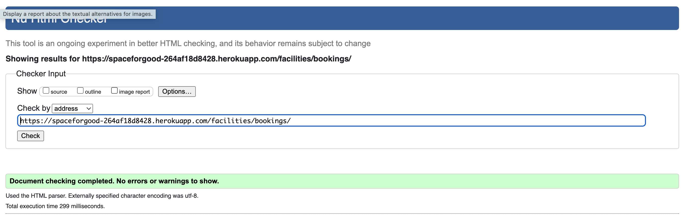
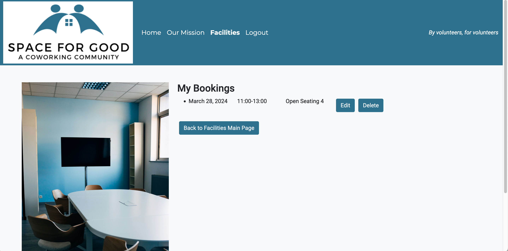
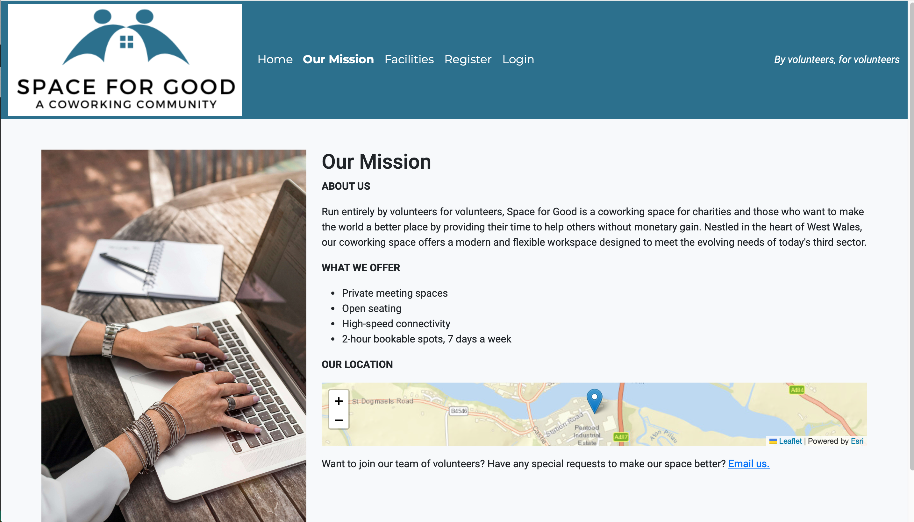
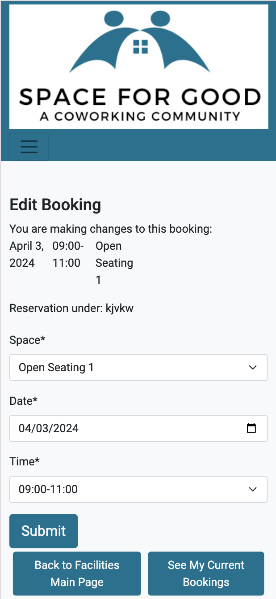
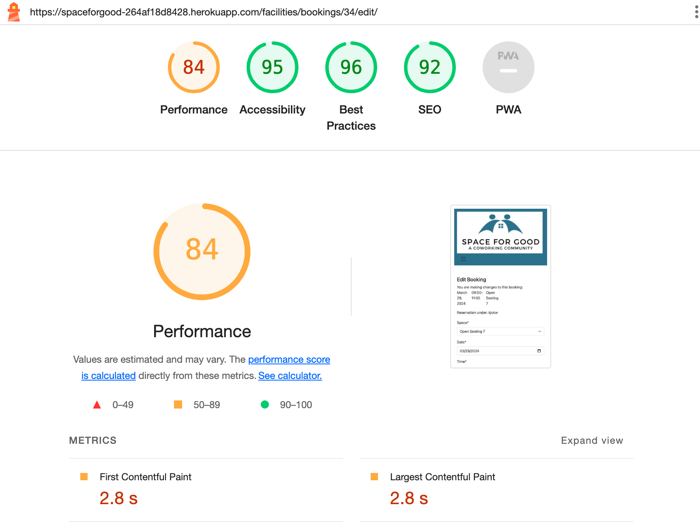
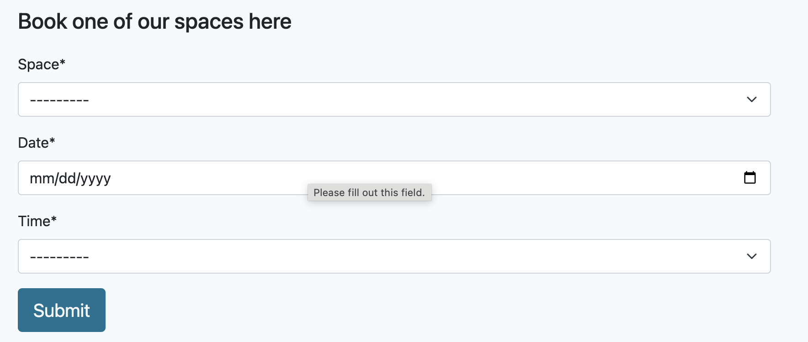
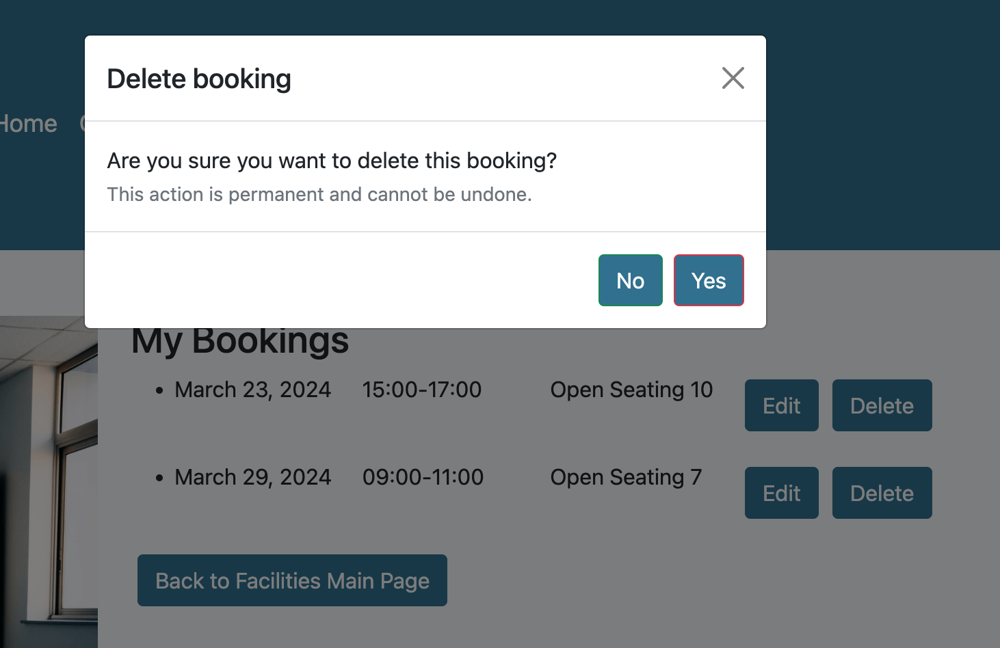
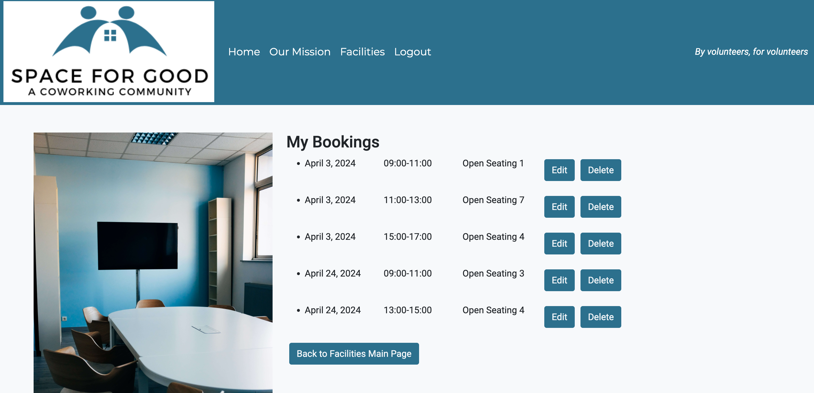

# Testing

> [!NOTE]  
> Return back to the [README.md](README.md) file.

## Code Validation

### HTML

I have used the recommended [HTML W3C Validator](https://validator.w3.org) to validate all of my HTML files.

| Directory | File | Screenshot | Notes |
| --- | --- | --- | --- |
| facilities | bookings.html |  | |
| facilities | edit_booking.html |  | |
| facilities | facilities.html |  | |
| main | index.html |  | |
| our_mission | our_mission.html |  | |

### CSS

I have used the recommended [CSS Jigsaw Validator](https://jigsaw.w3.org/css-validator) to validate all of my CSS files.

| Directory | File | Screenshot | Notes |
| --- | --- | --- | --- |
| static | style.css by direct input  |  | |
| static | style.css by URL |  | |

### JavaScript

I have used the recommended [JShint Validator](https://jshint.com) to validate all of my JS files.

| Directory | File | Screenshot | Notes |
| --- | --- | --- | --- |
| static | bookings.js |  | |

### Python

I have used the recommended [PEP8 CI Python Linter](https://pep8ci.herokuapp.com) to validate all of my Python files.

| Directory | File | CI URL | Screenshot | Notes |
| --- | --- | --- | --- | --- |
| facilities | admin.py | [PEP8 CI](https://pep8ci.herokuapp.com/https://raw.githubusercontent.com/KJWhitehead/space-for-good/main/facilities/admin.py) |  | |
| facilities | forms.py | [PEP8 CI](https://pep8ci.herokuapp.com/https://raw.githubusercontent.com/KJWhitehead/space-for-good/main/facilities/forms.py) |  | |
| facilities | models.py | [PEP8 CI](https://pep8ci.herokuapp.com/https://raw.githubusercontent.com/KJWhitehead/space-for-good/main/facilities/models.py) |  | |
| facilities | urls.py | [PEP8 CI](https://pep8ci.herokuapp.com/https://raw.githubusercontent.com/KJWhitehead/space-for-good/main/facilities/urls.py) |  | |
| facilities | views.py | [PEP8 CI](https://pep8ci.herokuapp.com/https://raw.githubusercontent.com/KJWhitehead/space-for-good/main/facilities/views.py) |  | |
| main | admin.py | [PEP8 CI](https://pep8ci.herokuapp.com/https://raw.githubusercontent.com/KJWhitehead/space-for-good/main/main/admin.py) |  | |
| main | models.py | [PEP8 CI](https://pep8ci.herokuapp.com/https://raw.githubusercontent.com/KJWhitehead/space-for-good/main/main/models.py) |  | |
| main | urls.py | [PEP8 CI](https://pep8ci.herokuapp.com/https://raw.githubusercontent.com/KJWhitehead/space-for-good/main/main/urls.py) |  | |
| main | views.py | [PEP8 CI](https://pep8ci.herokuapp.com/https://raw.githubusercontent.com/KJWhitehead/space-for-good/main/main/views.py) |  | |
|  | manage.py | [PEP8 CI](https://pep8ci.herokuapp.com/https://raw.githubusercontent.com/KJWhitehead/space-for-good/main/manage.py) |  | |
| our_mission | admin.py | [PEP8 CI](https://pep8ci.herokuapp.com/https://raw.githubusercontent.com/KJWhitehead/space-for-good/main/our_mission/admin.py) |  | |
| our_mission | models.py | [PEP8 CI](https://pep8ci.herokuapp.com/https://raw.githubusercontent.com/KJWhitehead/space-for-good/main/our_mission/models.py) |  | |
| our_mission | urls.py | [PEP8 CI](https://pep8ci.herokuapp.com/https://raw.githubusercontent.com/KJWhitehead/space-for-good/main/our_mission/urls.py) |  | |
| our_mission | views.py | [PEP8 CI](https://pep8ci.herokuapp.com/https://raw.githubusercontent.com/KJWhitehead/space-for-good/main/our_mission/views.py) |  | |
| space | settings.py | [PEP8 CI](https://pep8ci.herokuapp.com/https://raw.githubusercontent.com/KJWhitehead/space-for-good/main/space/settings.py) |  | |
| space | urls.py | [PEP8 CI](https://pep8ci.herokuapp.com/https://raw.githubusercontent.com/KJWhitehead/space-for-good/main/space/urls.py) |  | |

## Browser Compatibility

I've tested my deployed project on multiple browsers to check for compatibility issues.

| Browser | Home | Our Mission | Facilities | Bookings | Edit Booking | Notes |
| --- | --- | --- | --- | --- | --- | --- |
| Chrome |  |  |  |  |   | Displayed as expected |
| Firefox |  |  |  |  |   | Displayed as expected |
| Safari |  |  |  |   |   | |Phone number in footer is in blue on Safari on iPhone |

## Responsiveness

I've tested my deployed project on multiple devices to check for responsiveness issues.

| Device | Home | Our Mission | Facilities | Bookings | Edit Booking | Notes |
| --- | --- | --- | --- | --- | --- | --- |
| Mobile (DevTools) |  |  |  |  |  | Works as expected |
| Tablet (DevTools) |  |  |  |  |  | Works as expected |
| Desktop |  |  |  |  |  | Works as expected |

## Lighthouse Audit

I've tested my deployed project using the Lighthouse Audit tool to check for any major issues.

| Page | Mobile | Desktop | Notes |
| --- | --- | --- | --- |
| Home |  |  | Poor performance in mobile due to large images |
| Our Mission |  |  | Slow response time due to large images|
| Facilities |  |  | Slow response time due to large images |
| Bookings |  |  | Slow response time due to large images |
| Edit Booking |  |  | Slow response time due to large images |

## Defensive Programming

Defensive programming was manually tested with the below user acceptance testing:

| Page | Expectation | Test | Result | Fix | Screenshot |
| --- | --- | --- | --- | --- | --- |
| Home | | | | | |
| | Feature is expected to navigate to Our Mission page when the user clicks on Our Mission | Tested the feature by clicking on Our Mission | The feature behaved as expected, and it navigated to Our Mission | Test concluded and passed |  |
| | Feature is expected to navigate to Facilities page when the user clicks on Facilities | Tested the feature by clicking on Facilities| The feature behaved as expected, and it navigated to Facilities | Test concluded and passed |  |
| | Feature is expected to navigate to main page when the user clicks on logo | Tested the feature by clicking on logo | The feature behaved as expected, and it navigated to main page | Test concluded and passed |  |
| | Feature is expected to navigate to main page when the user clicks on Home | Tested the feature by clicking on Home | The feature behaved as expected, and it navigated to main page | Test concluded and passed |  |
| | Feature is expected to navigate to register when the user clicks on Register | Tested the feature by clicking on Register | The feature behaved as expected, and it navigated to the registration page | Test concluded and passed |  |
| | Feature is expected to navigate to sign in page when the user clicks on Sign In | Tested the feature by clicking on Sign In | The feature behaved as expected, and it navigated to the sign in page | Test concluded and passed |  |
| | Feature is expected to provide social media links when the user clicks on icons | Tested the feature by clicking on social media icons | The feature behaved as expected and navigated to the social media sites in new tabs | Test concluded and passed |  |
| | Feature is expected to provide an image of the space | Tested the feature by viewing page | The feature could be viewed as expected | Test concluded and passed |  |
| Our Mission | | | | | |
| | Feature is expected to provide a general description of what is available | Tested the feature by viewing page | The feature could be viewed as expected | Test concluded and passed |  |
| | Feature is expected to provide a map of the area | Tested the feature by viewing page | The feature could be viewed as expected | Test concluded and passed |  |
| Facilities | | | | | |
| | The feature expects users to create an account to view Facilities | Tested the feature by clicking on Facilities while not logged in | The feature behaved as expected, and it directed the user to the Log In page | Test concluded and passed |  |
| | The feature is expected to provide a specific description of the spaces and nearby amenities | Tested the feature by viewing page | The feature could be viewed as expected | Test concluded and passed |  |
| | Feature is expected to allow user to make a booking with drop-down menus for ease of use. | Tested the feature making a booking for a space at a date and time | The feature made the booking and allowed an alert stating that it was made. | Test concluded and passed |  |
| Bookings | | | | | |
| | Feature is expected to allow user to view their existing bookings when clicking on the "See My Current Bookings" button. | Tested the feature by clicking on the button. It was also tested by signing out of the account and once more attempting to load the page. | The feature behaved as expected, existing bookings could be viewed. Non-logged in users were re-directed and other users could only view their own bookings. | Test concluded and passed |  |
| | Feature is expected to delete a booking when the delete button is clicked. | Tested the feature clicking on the delete button | The feature behaved as expected. A modal was engaged that asked for confirmation and, upon confirmation, the booking was deleted. | Test concluded and passed. |  |
| Edit Booking | | | | | |
| | Feature is expected to allow user to edit their existing bookings when clicking on the "Edit" button. | Tested the feature by clicking on the button. It was also tested by signing out of the account and once more attempting to load the page. | The feature behaved as expected, the booking could be edited. Non-logged in users were re-directed and other users could not edit others' bookings. | Test concluded and passed |  |

## User Story Testing

| User Story | Screenshot |
| --- | --- |
| As a new site user, I would like to view the NavBar on every page, so that I can quickly navigate the site. |  |
| As a new site user, I would like to register an account, so that I can make bookings. |  |
| As a new site user, I would like to to know when I can use the workspaces, so that I can volunteer in the evenings and weekends. |  |
| As a new site user, I would like to see what is available in coworking space, so that I can make an informed decision before signing up. |  |
| As a new site user, I would like to to know the rules of the space (like if guests are permitted), so that I can decide whether to register. | This will be a feature on future sprints. |
| As a returning site user, I would like to know the location and nearby amenities of the coworking space, so that I can know where to go and what I can eat there. |  |
| As a returning site user, I would like to easily book a workspace for a specific date and time through an intuitive online platform, so that I can plan my work schedule efficiently. |  |
| As a returning site user, I would like contact information, so that I can reach out to the coworking space with specific demands. |  |
| As a returning site user, I would like to see a calendar of upcoming networking events, workshops, and professional development opportunities hosted by the coworking space, so that I can stay engaged and connected with other charities. | This will be a feature on future sprints. |
| As a returning site user, I would like to see a member directory, so that I can connect with others. | This will be a feature on future sprints. |
| As a site administrator, I should be able to use recognizable branding, so that our brand is clear to users. |  |
| As a site administrator, I want users to be able to log in and out with notifications, so that they are aware of their status. |    |
| As a site administrator, I should be able to advertise how to volunteer as workers at Space for Good, so that I can maintain the free community space. | This will be a feature on future sprints. |

## Bugs

**Fixed Bugs**

- The pages bookings.html and edit_booking.html within the Facilities app did not have "Facilities" as active in the navbar.

    

    - To fix this, I changed the class to: "text-white nav-link active".

- The view booking function was not displaying the booking in date and time order, making for bad UX.

    

    - To fix this, I added: |dictsort:"time"|dictsort:"date".

- During this project, even with whitenoise installed, static was not automatically collected.

    - To fix this, I ran the collectstatic command in terminal.

**Open Issues**

Any remaining open issues can be tracked [here](https://github.com/KJWhitehead/space-for-good/issues). They all relate to future sprints.

## Unfixed Bugs

> [!NOTE]  
> There are no remaining bugs that I am aware of.
